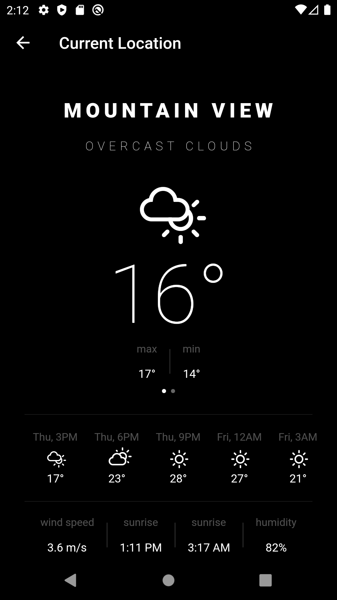

# Flutter Weather App

A flutter project to view current weather status of cities.

## Getting Started

This project was developed specifically for checking weather status of cities in Malaysia. It consists of city.json file
stored in the asset folder retrieved from this link [https://simplemaps.com/data/my-cities](https://simplemaps.com/data/my-cities)
By default, the app provide 3 cities selection for the user to choose to check the weather: 
a.	Kuala Lumpur (Default selection)
b.	George Town
c.	Johor Bahru

The weather data display will change according to the selection. There are three (3) build environment [DEVELOPMENT, PRODUCTION, QA]()

## 💻 Requirements
* Any Operating System (ie. MacOS X, Linux, Windows)
* Any IDE with Flutter SDK installed (ie. IntelliJ, Android Studio, VSCode etc)
* A little knowledge of Dart and Flutter
* A brain to think 🤓🤓

## ✨ Features
- [x] Beautiful minimal UI
- [x] Dark and Light themes
- [x] Current temperature, max and min temperature, sunset, sunrise
- [x] Custom icons for each weather condition
- [x] 5 day forecast
- [x] Beautifully animated transitions
- [x] Line graph to show temperature variance
- [x] Add cities
- [x] Set default city tab position
- [x] A feature to use “Current Location” to display the weather information. This will detect user current location and get the geolocation, and call to the API using longitude and latitude. 

## 📸 ScreenShots

| Dark| Light|
|------|-------|
|||
|||
|||
|||


## 🔌 Plugins
| Name | Usage |
|------|-------|
|[**BLOC**](https://pub.dev/packages/bloc)| State Management |
|[**Flutter BLOC**](https://pub.dev/packages/flutter_bloc)| Flutter Widgets that make it easy to implement the BLoC |
|[**Provider**](https://pub.dev/packages/provider)| Listening to Instant Internet Connection Changes |
|[**Http**](https://pub.dev/packages/http)| HTTP Requests|
|[**Connectivity**](https://pub.dev/packages/connectivity)| Internet Connection|
|[**Equatable**](https://pub.dev/packages/equatable)| Integration with BLOC Events |
|[**Intl**](https://pub.dev/packages/intl)| Internationalization and localization facilities |
|[**SharedPreference**](https://pub.dev/packages/shared_preferences)| Platform-specific persistent storage  |
|[**GeoLocator**](https://pub.dev/packages/geolocator)| Provide easy access to platform-specific location services  |
|[**Permission Handler**](https://pub.dev/packages/permission_handler)| Provide platform-specific API to request and check permissions |
|[**Charts Flutter**](https://pub.dev/packages/charts_flutter)| Material Design charting |
|[**Flutter Swiper**](https://pub.dev/packages/flutter_swiper)| Swiping between layouts |
|[**Carousel Slider**](https://pub.dev/packages/carousel_slider)| Carousel Slider |


### Installing

**API Key**

Create a file called `api_keys.dart` in `lib/src/api/`

Make a class called `ApiKey` with your openweathermaps API key in it. Get it [here](https://openweathermap.org/api)

eg:
  ```
  class ApiKey {
    static const OPEN_WEATHER_MAP = 'your_key';
  }
  ```

## 🤓 Author
**Emmanuel Iwearu** 

